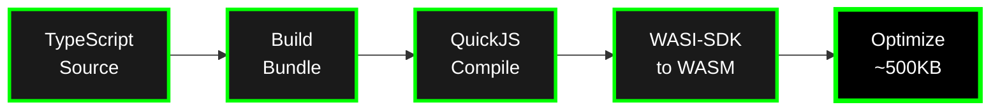
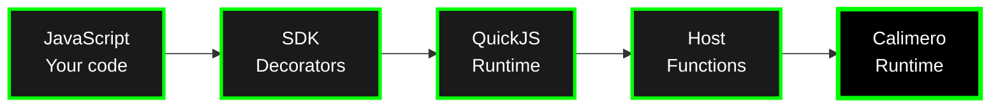

# Calimero JavaScript SDK Guide

Build Calimero services using **TypeScript/JavaScript**. The JavaScript SDK compiles your code to WebAssembly using QuickJS, enabling you to build distributed applications without writing Rust.

> ⚠️ **Experimental:** The JavaScript SDK is still evolving. Expect breaking changes while we stabilize the toolchain.

## Overview

The JavaScript SDK (`calimero-sdk-js`) consists of two main packages:

- **`@calimero-network/calimero-sdk-js`** - Decorators, CRDT collections, event system, and environment bindings
- **`@calimero-network/calimero-cli-js`** - Build toolchain (Rollup → QuickJS → WASM)

**Key features:**

- Write services in TypeScript/JavaScript instead of Rust
- Same CRDT collections as Rust SDK
- Automatic conflict resolution
- Event-driven architecture
- Private storage for node-local data

## Architecture

### Build Pipeline



### Runtime Execution



**How the SDK works:**

- Your TypeScript code runs inside QuickJS (a lightweight JavaScript engine)
- CRDT operations call host functions that interact with Rust storage
- State is serialized and synchronized across the network
- Events propagate to all peers automatically

## Getting Started

### Prerequisites

- Node.js 18+ with WASI support
- `pnpm` ≥ 8 (or npm/yarn)
- Access to a Calimero node (`merod`) and CLI (`meroctl`)

### TypeScript Project setup

> **NOTE**: There is also an npx command `npx create-mero-app my-app` which generates a template for Rust or Tyepscript application including frontend, application logic, scripts and workflows, see [Getting started](../getting-started/index.md/#__tabbed_3_1){:target="_blank"} for more information.

```bash
$: mkdir my-calimero-js-app
$: cd my-calimero-js-app
$: pnpm init -y
> Wrote to /Users/X/Desktop/my-calimero-js-app/package.json
>
> {
>   "name": "my-calimero-js-app",
>   "version": "1.0.0",
>   "description": "",
>   "main": "index.js",
>   "scripts": {
>    "test": "echo \"Error: no test specified\" && exit 1"
>   },
>   "keywords": [],
>   "author": "",
>   "license": "ISC"
> }


#Add following build script which will be used later to generate .WASM from the typescript application.
# package.json
{
  ...,
  "scripts": {
    "test": "echo \"Error: no test specified\" && exit 1",
    "build": "calimero-sdk build src/index.ts -o build/my-calimero-js-app.wasm"
  },
  ...
}

$:  pnpm add typescript && npx tsc --init
> +
> Progress: resolved 4, reused 4, downloaded 0, added 1, done
> 
> dependencies:
> + typescript 5.9.3
> 
> Done in 3s
> 
> Created a new tsconfig.json
```

Update tsconfig.json with following settings
```json
{
  "compilerOptions": {
    "target": "ES2020",
    "module": "ESNext",
    "lib": ["ES2020"],
    "moduleResolution": "bundler",
    "strict": true,
    "esModuleInterop": true,
    "skipLibCheck": true,
    "forceConsistentCasingInFileNames": true,
    "resolveJsonModule": true,
    "outDir": "./build",
    "rootDir": "./src",
    "composite": false,
    "experimentalDecorators": true,
    "emitDecoratorMetadata": true
  },
  "include": ["src/**/*"]
}

```

### Installation

```bash
$: pnpm add @calimero-network/calimero-sdk-js
> ...
> Progress: resolved 213, reused 145, downloaded 44, added 189, done
> node_modules/.pnpm/@calimero-network+calimero-sdk-js@0.2.3_typescript@5.9.3/node_modules/@calimero-network/calimero-sdk-js: Running postinstall script...
> dependencies:
> + @calimero-network/calimero-sdk-js 0.2.3

$: pnpm add -D @calimero-network/calimero-cli-js tslib
> ...
> devDependencies:
> + @calimero-network/calimero-cli-js ^0.3.0
> + tslib 2.8.1

# Use following command if post install doesn't trigger deps installation
$: cd node_modules/@calimero-network/calimero-cli-js && pnpm install-deps
> 🔧 Installing Calimero SDK build dependencies...
> ...

# Create index file
$: mkdir src && touch src/index.ts
```

**NPM Resources:**

- Calimero SDK JS - [NPM package](https://www.npmjs.com/package/@calimero-network/calimero-sdk-js){:target="_blank"}
- Calimero CLI JS - [NPM package](https://www.npmjs.com/package/@calimero-network/calimero-cli-js){:target="_blank"}

### Minimal Application Example

```typescript
// index.ts
import { State, Logic, Init, View } from '@calimero-network/calimero-sdk-js';
import { Counter } from '@calimero-network/calimero-sdk-js/collections';
import * as env from '@calimero-network/calimero-sdk-js/env';

@State
export class CounterApp {
  count: Counter = new Counter();
}

@Logic(CounterApp)
export class CounterLogic extends CounterApp {
  @Init
  static init(): CounterApp {
    env.log('Initializing counter');
    return new CounterApp();
  }

  increment(): void {
    env.log('Incrementing counter');
    this.count.increment();
  }

  @View()
  getCount(): bigint {
    return this.count.value();
  }
}
```

### Build & Deploy

```bash
# Build WASM from TypeScript
$: pnpm build
> my-calimero-js-app@1.0.0 build /Users/X/Desktop/my-calimero-js-app
> calimero-sdk build src/index.ts -o build/my-calimero-js-app.wasm

> [build] › …  awaiting  Extracting service methods...
> [build] › ✔  success   Contract built successfully: build/my-calimero-js-app.wasm (1456.35 KB)

# Install application wasm on the node
$: meroctl --node node1 app install \
  --path build/my-calimero-js-app.wasm
> ╭───────────────────────────────────────────────────────────────────────────────────╮
> │ Application Installed                                                             │
> ╞═══════════════════════════════════════════════════════════════════════════════════╡
> │ Successfully installed application 'EdQAQGNLHBpM8atH18re56RmxL676WCJZEZvCPdXQbbw' │
> ╰───────────────────────────────────────────────────────────────────────────────────╯

# Create a context for installed application
$: $: meroctl --node node1 context create \
  --protocol near --application-id EdQAQGNLHBpM8atH18re56RmxL676WCJZEZvCPdXQbbw
> +------------------------------+
> | Context Created              |
> +==============================+
> | Successfully created context |
> +------------------------------+

# View context ID and context identity
$: meroctl --node node1 context ls 
> +----------------------------------------------+----------------------------------------------+------------------------------------------------------+
> | Context ID                                   | Application ID                               | Root Hash                                            |
> +====================================================================================================================================================+
> | 9MYohRkkpT1QXtBGAcXYeB7yTtWNeFrVieK47tV4TSx9 | EdQAQGNLHBpM8atH18re56RmxL676WCJZEZvCPdXQbbw | Hash("J6XbiySdR1cdcBYkHfxpdP4hFQ9aLvLSe2knvPW7SJxG") |
> +----------------------------------------------+----------------------------------------------+------------------------------------------------------+

$: meroctl --node node1 context identity list --context 9MYohRkkpT1QXtBGAcXYeB7yTtWNeFrVieK47tV4TSx9
> +----------------------------------------------+------------------+
> | Identity                                     | Type             |
> +=================================================================+
> | E9X7upjmMoZB5FL79JSuxUY2i873DvZ5f7QkLcSat89e | Context Identity |
> +----------------------------------------------+------------------+

# Call methods
# Calling getCount to verify that the counter value is 0
$: meroctl --node node1 call getCount \
  --context 9MYohRkkpT1QXtBGAcXYeB7yTtWNeFrVieK47tV4TSx9 \
  --as E9X7upjmMoZB5FL79JSuxUY2i873DvZ5f7QkLcSat89e
> ...
> "result": {
>    "output": "0"
>  }
> ...

# Calling increment which will increase the counter value to 1
$: meroctl --node node1 call increment \
 --context 9MYohRkkpT1QXtBGAcXYeB7yTtWNeFrVieK47tV4TSx9 \
 --as E9X7upjmMoZB5FL79JSuxUY2i873DvZ5f7QkLcSat89e
> +-------------------+---------+
> | Response          | Status  |
> +=============================+
> | JSON-RPC Response | Success |
> +-------------------+---------+

# Callin getCount to verify that the counter value is 1
$: meroctl --node node1 call getCount \
  --context 9MYohRkkpT1QXtBGAcXYeB7yTtWNeFrVieK47tV4TSx9 \
  --as E9X7upjmMoZB5FL79JSuxUY2i873DvZ5f7QkLcSat89e
> ...
> "result": {
>     "output": "1"
>   }
> ...
```

## Core Concepts

### Decorators

#### @State

Marks a class as application state:

```typescript
import { State } from '@calimero-network/calimero-sdk-js';
import { UnorderedMap, Counter } from '@calimero-network/calimero-sdk-js/collections';

@State
export class MyApp {
  items: UnorderedMap<string, string> = new UnorderedMap();
  viewCount: Counter = new Counter();
}
```

**Key points:**

- State is persisted and synchronized across nodes
- Initialize CRDT fields inline (runtime reuses persisted IDs)
- Don't use regular JavaScript objects for synchronized state

#### @Logic

Marks a class as application logic (methods):

```typescript
import { Logic, Init, Logic } from '@calimero-network/calimero-sdk-js';

@Logic(MyApp)
export class MyAppLogic extends MyApp {
  @Init
  static init(): MyApp {
    return new MyApp();
  }

  // Mutation method (changes state)
  addItem(key: string, value: string): void {
    this.items.set(key, value);
  }

  // View method (read-only)
  @View()
  getItem(key: string): string | null {
    return this.items.get(key);
  }
}
```

**Key points:**

- Logic class extends State class
- `@Init` marks the initialization method (called once on context creation)
- Methods without `@View()` are mutations (generate deltas)
- Methods with `@View()` are read-only (no delta generated)

#### @View()

Marks read-only methods:

```typescript
@Logic(MyApp)
export class MyAppLogic extends MyApp {
  // View - read-only, no delta
  @View()
  getValue(): string {
    return this.register.get();
  }
}
```

**Benefits:**
- Faster execution (no persistence overhead)
- No redundant storage deltas
- Clear intent in API

#### @Event

Marks event classes:

```typescript
import { Event } from '@calimero-network/calimero-sdk-js';

@Event
export class ItemAdded {
  constructor(
    public key: string,
    public value: string,
  ) {}
}

// Emit an event inside a function
...
addItem(key: string, value: string): void {
    emit(new ItemAdded(key, value));
    this.items.set(key, value);
}
...
```

#### @Init

Marks the initialization method:

```typescript
@Logic(MyApp)
export class MyAppLogic extends MyApp {
  @Init
  static init(): MyApp {
    return new MyApp();
  }
}
```

**Requirements:**

- Must be static
- Must return an instance of State class
- Called once when context is created

### CRDT Collections

The JavaScript SDK provides the same CRDT collections as the Rust SDK:

#### UnorderedMap<K, V>

Key-value storage:

```typescript
import { UnorderedMap } from '@calimero-network/calimero-sdk-js/collections';

const map = new UnorderedMap<string, string>();

// Set value
map.set('key', 'value');

// Get value
const value = map.get('key'); // 'value' | undefined

// Check existence
const exists = map.has('key'); // boolean

// Remove entry
map.remove('key');

// Iterate
const entries = map.entries(); // [['key1', 'value1'], ['key2', 'value2']]
const keys = map.keys(); // ['key1', 'key2']
const values = map.values(); // ['value1', 'value2']

// Size
const size = map.entries().length;
```

#### Vector<T>

Ordered list maintaining insertion order:

```typescript
import { Vector } from '@calimero-network/calimero-sdk-js/collections';

const vec = new Vector<string>();

// Add element
vec.push('first');
vec.push('second');

// Get element
const item = vec.get(0); // 'first'

// Remove element
const last = vec.pop(); // 'second'

// Length
const len = vec.len(); // number
```

#### Counter

Distributed counter with automatic summation:

```typescript
import { Counter } from '@calimero-network/calimero-sdk-js/collections';

const counter = new Counter();

// Increment
counter.increment();
counter.incrementBy(5);

// Get value
const total = counter.value(); // bigint
```

#### LwwRegister<T>

Last-Write-Wins register for single values:

```typescript
import { LwwRegister } from '@calimero-network/calimero-sdk-js/collections';

const register = new LwwRegister<string>();

// Set value
register.set('hello');

// Get value
const value = register.get(); // 'hello' | null

// Get timestamp
const timestamp = register.timestamp(); // bigint
```

#### UnorderedSet<T>

Set with union-based merging:

```typescript
import { UnorderedSet } from '@calimero-network/calimero-sdk-js/collections';

const set = new UnorderedSet<string>();

// Add element
set.add('item'); // true on first insert

// Check membership
const has = set.has('item'); // boolean

// Remove element
set.delete('item');

// Get all values
const all = set.toArray(); // string[]

// Size
const size = set.size(); // number
```

### Nested CRDTs

CRDTs can be nested arbitrarily:

```typescript
@State
export class TeamMetrics {
  // Map of member → Map of metric → Counter
  memberMetrics: UnorderedMap<string, UnorderedMap<string, LwwRegister<Counter>>>;
  
  // Map of team → Set of members
  teams: UnorderedMap<string, UnorderedSet<string>>;
  
  // Vector of profiles (each with nested data)
  profiles: Vector<MemberProfile>;

  constructor() {
    this.memberMetrics = new UnorderedMap();
    this.teams = new UnorderedMap();
    this.profiles = new Vector();
  }
}
```

**Important:** When you get a nested CRDT, you receive a **handle** that retains the CRDT ID. Mutating the handle issues host calls without deserializing the entire structure.

```typescript
// Get nested map handle (lightweight, ID retained)
const metrics = this.memberMetrics.get('alice');

if (metrics) {
  // Mutate nested CRDT (incremental host call)
  const counter = metrics.get('commits') ?? new Counter();
  counter.increment();
  metrics.set('commits', counter);
}
```

### Event System

Emit events for real-time updates:

```typescript
import { Event, emit, emitWithHandler } from '@calimero-network/calimero-sdk-js';

// Define event
@Event
export class ItemAdded {
  constructor(public key: string, public value: string) {}
}

@Logic(MyApp)
export class MyAppLogic extends MyApp {
  addItem(key: string, value: string): void {
    this.items.set(key, value);
    
    // Emit event without handler
    emit(new ItemAdded(key, value));
    
    // Or emit with handler (handler executes on receiving nodes)
    emitWithHandler(new ItemAdded(key, value), 'onItemAdded');
  }

  // Event handler (runs on peer nodes, not author node)
  onItemAdded(event: ItemAdded): void {
    this.itemCount.increment();
    env.log(`Item added: ${event.key} = ${event.value}`);
  }
}
```

**Event lifecycle:**

1. Emitted during method execution
2. Included in delta broadcast to all peers
3. Handlers execute on peer nodes (not author node)
4. Handlers can update state or trigger side effects

**Handler requirements:**

- **Commutative**: Order-independent operations
- **Independent**: No shared mutable state between handlers
- **Idempotent**: Safe to retry
- **Pure**: No external side effects (only state updates)

### User Storage

User-owned, signed storage collection for per-user data. Keys are PublicKeys (32 bytes) that identify the user who owns the data. Writes are signed by the executor and verified on other nodes.

```typescript
import { UserStorage } from '@calimero-network/calimero-sdk-js/collections';
import { createUserStorage } from '@calimero-network/calimero-sdk-js';

interface UserProfile {
  displayName: string;
  score: number;
  badges: string[];
}

// Create a user storage for user profiles
const userProfiles = createUserStorage<UserProfile>();

// Insert data for the current executor (key is automatically set to executor's PublicKey)
userProfiles.insert({
  displayName: 'Alice',
  score: 100,
  badges: ['newcomer', 'contributor'],
});

// Get current user's data
const myProfile = userProfiles.get();

// Get any user's data by their PublicKey
const somePublicKey = new Uint8Array(32); // Another user's public key
const otherProfile = userProfiles.getForUser(somePublicKey);

// Check if current user has data
const hasProfile = userProfiles.containsCurrentUser();

// Check if another user has data
const hasOther = userProfiles.containsUser(somePublicKey);

// Remove current user's data
userProfiles.remove();

// Iterate over all users
const allUsers = userProfiles.entries(); // [[publicKey, profile], ...]
const allKeys = userProfiles.keys(); // [publicKey1, publicKey2, ...]
const allProfiles = userProfiles.values(); // [profile1, profile2, ...]
const count = userProfiles.size(); // number of users
```

#### How It Works

1. **Writing**: When a user modifies data in `UserStorage`, the storage layer creates an action marked with `StorageType::User`.
2. **Signing**: The action is signed using the executor's identity private key, with a `signature` and `nonce` embedded in the metadata.
3. **Verification**: When other nodes receive this action, they verify:

     - **Signature**: Validates against the owner's public key
     - **Replay Protection**: Ensures the nonce is strictly greater than the last-seen nonce

#### Use Cases

- Per-user settings and preferences
- User-owned game data (scores, inventory)
- Personal documents with ownership verification
- Any data that should be verifiably owned by a specific user

### Private Storage

For node-local data (secrets, caches, per-node counters):

```typescript
import { createPrivateEntry } from '@calimero-network/calimero-sdk-js';

// Create private entry
const secrets = createPrivateEntry<{ token: string }>('private:secrets');

// Get or initialize
const current = secrets.getOrInit(() => ({ token: '' }));

// Modify (never synced across nodes)
secrets.modify(
  (value) => {
    value.token = 'rotated-token';
  },
  () => ({ token: '' }) // Initial value if not exists
);
```

**Key properties:**

- Never replicated across nodes
- Stored via `storage_read` / `storage_write` directly
- Never included in CRDT deltas
- Only accessible on the executing node

### Frozen Storage

Immutable, content-addressable storage collection. Values are keyed by their SHA256 hash, ensuring content-addressability. Once inserted, values cannot be updated or deleted.

```typescript
import { FrozenStorage, FrozenValue } from '@calimero-network/calimero-sdk-js/collections';
import { createFrozenStorage } from '@calimero-network/calimero-sdk-js';

// Create frozen storage for documents
const documents = createFrozenStorage<Document>();

// Add a value - returns its SHA256 hash
const hash = documents.add({
  title: 'Important Document',
  content: 'This content is immutable...',
  timestamp: Date.now(),
});

// Retrieve by hash
const doc = documents.get(hash);

// Check if hash exists
const exists = documents.has(hash);

// Get all stored documents
const allEntries = documents.entries(); // [[hash, document], ...]
const allHashes = documents.hashes(); // [hash1, hash2, ...]
const allDocs = documents.values(); // [doc1, doc2, ...]

// Compute hash without storing (useful for deduplication)
const wouldBeHash = FrozenStorage.computeHash(myValue);

// Attempting to remove throws an error
// documents.remove(hash); // Error: FrozenStorage does not support remove
```

#### FrozenValue

The wrapper type that ensures immutability:

```typescript
import { FrozenValue } from '@calimero-network/calimero-sdk-js/collections';

// FrozenValue wraps any value
const frozen = new FrozenValue({ data: 'immutable' });
console.log(frozen.value); // { data: 'immutable' }

// Merge is a no-op - frozen values don't change
const other = new FrozenValue({ data: 'different' });
const result = frozen.merge(other); // Returns original frozen value
```

#### How It Works

1. **Content-Addressing**: When you call `add(value)`, the storage:
     - Serializes the value
     - Computes its SHA256 hash
     - Uses the hash as the key in the underlying map
2. **Immutability**: Values are wrapped in `FrozenValue<T>`, which has an empty merge implementation, preventing any changes.
3. **Verification**: The storage layer enforces:
     - **No Updates/Deletes**: Update and delete actions are strictly forbidden
     - **Content-Addressing**: Add actions are only accepted if the key matches the SHA256 hash of the value

#### Use Cases

- Audit logs and immutable records
- Document versioning (each version gets a unique hash)
- Certificates and attestations
- Content-addressable data sharing
- Deduplication (same content = same hash)

## Examples

The `calimero-sdk-js` repository includes comprehensive examples:

| Example | Demonstrates | Location |
| --- | --- | --- |
| **counter** | Basic Counter CRDT | `examples/counter` |
| **kv-store** | UnorderedMap + LwwRegister, events | `examples/kv-store` |
| **team-metrics** | Nested CRDTs, mergeable structs | `examples/team-metrics` |
| **private-data** | Private storage patterns | `examples/private-data` |
| **blobs** | Blob management | `examples/blobs` |
| **xcall** | Cross-context calls | `examples/xcall` |

**Run an example:**
```bash
# Clone repository
$: git clone https://github.com/calimero-network/calimero-sdk-js
> ...
> Cloning into 'calimero-sdk-js'...
> ...
> Resolving deltas: 100% (2299/2299), done.
$: cd calimero-sdk-js
# Build the sdk and cli packages
$: cd packages/sdk && pnpm build && cd ../cli && pnpm build && ../..
> > @calimero-network/calimero-sdk-js@0.0.0 build /Users/X/Desktop/calimero-sdk-js/packages/sdk
> tsc

> @calimero-network/calimero-cli-js@0.0.0 build /Users/X/Desktop/calimero-sdk-js/packages/cli
> tsc

# Run example workflow
$: cd examples/counter
$: pnpm install && pnpm build:manual
> ...
> dependencies:
> + @calimero-network/calimero-sdk-js 0.0.0 <- ../../packages/sdk
> 
> devDependencies:
> + @calimero-network/calimero-cli-js 0.0.0 <- ../../packages/cli
> ...
$: cd ../..

$: merobox bootstrap run workflows/counter-js.yml --log-level=trace
> ...
> 🚀 Executing Workflow: Counter App Test
> ...
> ...
> Workflow finished sucessfully!
```

## Comparison: JavaScript SDK vs Rust SDK

| Feature | JavaScript SDK | Rust SDK |
| --- | --- | --- |
| **Language** | TypeScript/JavaScript | Rust |
| **Runtime** | QuickJS (in WASM) | Native WASM |
| **Build Size** | ~500KB (includes QuickJS) | ~100KB (optimized) |
| **Performance** | Slower (JS interpreter) | Faster (native code) |
| **Development** | Easier (familiar JS syntax) | More learning curve |
| **Type Safety** | TypeScript | Rust |
| **CRDT Collections** | Same API | Same API |

**When to use JavaScript SDK:**

- Familiar with JavaScript/TypeScript
- Faster prototyping
- Less performance-critical applications
- Want to leverage existing JS libraries (via Rollup)

**When to use Rust SDK:**

- Need maximum performance
- Already familiar with Rust
- Complex algorithms or computations
- Minimal binary size requirements

## Deep Dives

For detailed JavaScript SDK documentation:

- **Repository**: [`calimero-network/calimero-sdk-js`](https://github.com/calimero-network/calimero-sdk-js){:target="_blank"} - Full source code
- **Getting Started**: [`docs/getting-started.md`](https://github.com/calimero-network/calimero-sdk-js/blob/master/docs/getting-started.md){:target="_blank"} - Step-by-step guide
- **Architecture**: [`docs/architecture.md`](https://github.com/calimero-network/calimero-sdk-js/blob/master/docs/architecture.md){:target="_blank"} - Build pipeline and runtime
- **Collections**: [`docs/collections.md`](https://github.com/calimero-network/calimero-sdk-js/blob/master/docs/collections.md){:target="_blank"} - CRDT usage guide
- **Events**: [`docs/events.md`](https://github.com/calimero-network/calimero-sdk-js/blob/master/docs/events.md){:target="_blank"} - Event patterns and handlers
- **Troubleshooting**: [`docs/troubleshooting.md`](https://github.com/calimero-network/calimero-sdk-js/blob/master/docs/troubleshooting.md){:target="_blank"} - Common issues

## Related Topics

- [SDK Guide (Rust)](sdk-guide.md) - Building with Rust SDK
- [Applications](../core-concepts/applications.md) - Application architecture overview
- [Core Apps Examples](../examples/core-apps-examples.md) - Rust SDK examples
- [Getting Started](../getting-started/index.md) - Complete getting started guide

