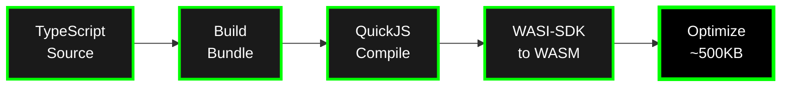
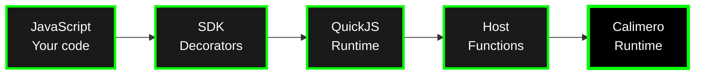

# Calimero JavaScript SDK Guide

Build Calimero services using **TypeScript/JavaScript**. The JavaScript SDK compiles your code to WebAssembly using QuickJS, enabling you to build distributed applications without writing Rust.

> ⚠️ **Experimental:** The JavaScript SDK is still evolving. Expect breaking changes while we stabilize the toolchain.

## Overview

The JavaScript SDK (`calimero-sdk-js`) consists of two main packages:

- **`@calimero/sdk`** - Decorators, CRDT collections, event system, and environment bindings
- **`@calimero/cli`** - Build toolchain (Rollup → QuickJS → WASM)

**Key features:**
- Write services in TypeScript/JavaScript instead of Rust
- Same CRDT collections as Rust SDK
- Automatic conflict resolution
- Event-driven architecture
- Private storage for node-local data

## Architecture

### Build Pipeline



### Runtime Execution



**How it works:**
- Your TypeScript code runs inside QuickJS (a lightweight JavaScript engine)
- CRDT operations call host functions that interact with Rust storage
- State is serialized and synchronized across the network
- Events propagate to all peers automatically

## Getting Started

### Prerequisites

- Node.js 18+ with WASI support
- `pnpm` ≥ 8 (or npm/yarn)
- Access to a Calimero node (`merod`) and CLI (`meroctl`)

### Installation

```bash
pnpm add @calimero/sdk
pnpm add -D @calimero/cli typescript
```

### Minimal Service

```typescript
import { State, Logic, Init, View } from '@calimero/sdk';
import { Counter } from '@calimero/sdk/collections';
import * as env from '@calimero/sdk/env';

@State
export class CounterApp {
  count: Counter = new Counter();
}

@Logic(CounterApp)
export class CounterLogic extends CounterApp {
  @Init
  static init(): CounterApp {
    env.log('Initializing counter');
    return new CounterApp();
  }

  increment(): void {
    env.log('Incrementing counter');
    this.count.increment();
  }

  @View()
  getCount(): bigint {
    return this.count.value();
  }
}
```

### Build & Deploy

```bash
# Build WASM from TypeScript
npx calimero-sdk build src/index.ts -o build/service.wasm

# Install on node
meroctl --node node1 app install \
  --path build/service.wasm \
  --context-id <CONTEXT_ID>

# Call methods
meroctl --node node1 call \
  --context-id <CONTEXT_ID> \
  --method increment

meroctl --node node1 call \
  --context-id <CONTEXT_ID> \
  --method getCount
```

## Core Concepts

### Decorators

#### @State

Marks a class as application state:

```typescript
import { State } from '@calimero/sdk';
import { UnorderedMap, Counter } from '@calimero/sdk/collections';

@State
export class MyApp {
  items: UnorderedMap<string, string> = new UnorderedMap();
  viewCount: Counter = new Counter();
}
```

**Key points:**
- State is persisted and synchronized across nodes
- Initialize CRDT fields inline (runtime reuses persisted IDs)
- Don't use regular JavaScript objects for synchronized state

#### @Logic

Marks a class as application logic (methods):

```typescript
import { Logic, Init } from '@calimero/sdk';

@Logic(MyApp)
export class MyAppLogic extends MyApp {
  @Init
  static init(): MyApp {
    return new MyApp();
  }

  // Mutation method (changes state)
  addItem(key: string, value: string): void {
    this.items.set(key, value);
  }

  // View method (read-only)
  @View()
  getItem(key: string): string | undefined {
    return this.items.get(key);
  }
}
```

**Key points:**
- Logic class extends State class
- `@Init` marks the initialization method (called once on context creation)
- Methods without `@View()` are mutations (generate deltas)
- Methods with `@View()` are read-only (no delta generated)

#### @View()

Marks read-only methods:

```typescript
@Logic(MyApp)
export class MyAppLogic extends MyApp {
  // Mutation - generates delta
  setValue(value: string): void {
    this.register.set(value);
  }

  // View - read-only, no delta
  @View()
  getValue(): string {
    return this.register.get();
  }
}
```

**Benefits:**
- Faster execution (no persistence overhead)
- No redundant storage deltas
- Clear intent in API

#### @Event

Marks event classes:

```typescript
import { Event } from '@calimero/sdk';

@Event
export class ItemAdded {
  constructor(
    public key: string,
    public value: string,
    public timestamp: number
  ) {}
}
```

#### @Init

Marks the initialization method:

```typescript
@Logic(MyApp)
export class MyAppLogic extends MyApp {
  @Init
  static init(): MyApp {
    return new MyApp();
  }
}
```

**Requirements:**
- Must be static
- Must return an instance of State class
- Called once when context is created

### CRDT Collections

The JavaScript SDK provides the same CRDT collections as the Rust SDK:

#### UnorderedMap<K, V>

Key-value storage with Last-Write-Wins conflict resolution:

```typescript
import { UnorderedMap } from '@calimero/sdk/collections';

const map = new UnorderedMap<string, string>();

// Set value
map.set('key', 'value');

// Get value
const value = map.get('key'); // 'value' | undefined

// Check existence
const exists = map.has('key'); // boolean

// Remove entry
map.remove('key');

// Iterate
const entries = map.entries(); // [['key1', 'value1'], ['key2', 'value2']]
const keys = map.keys(); // ['key1', 'key2']
const values = map.values(); // ['value1', 'value2']

// Size
const size = map.entries().length;
```

#### Vector<T>

Ordered list maintaining insertion order:

```typescript
import { Vector } from '@calimero/sdk/collections';

const vec = new Vector<string>();

// Add element
vec.push('first');
vec.push('second');

// Get element
const item = vec.get(0); // 'first'

// Remove element
const last = vec.pop(); // 'second'

// Length
const len = vec.len(); // number
```

#### Counter

Distributed counter with automatic summation:

```typescript
import { Counter } from '@calimero/sdk/collections';

const counter = new Counter();

// Increment
counter.increment();
counter.incrementBy(5);

// Get value
const total = counter.value(); // bigint

// Decrement
counter.decrement();
counter.decrementBy(2);
```

#### LwwRegister<T>

Last-Write-Wins register for single values:

```typescript
import { LwwRegister } from '@calimero/sdk/collections';

const register = new LwwRegister<string>();

// Set value
register.set('hello');

// Get value
const value = register.get(); // 'hello' | null

// Get timestamp
const timestamp = register.timestamp(); // bigint
```

#### UnorderedSet<T>

Set with union-based merging:

```typescript
import { UnorderedSet } from '@calimero/sdk/collections';

const set = new UnorderedSet<string>();

// Add element
set.add('item'); // true on first insert

// Check membership
const has = set.has('item'); // boolean

// Remove element
set.delete('item');

// Get all values
const all = set.toArray(); // string[]

// Size
const size = set.size(); // number
```

### Nested CRDTs

CRDTs can be nested arbitrarily:

```typescript
@State
export class TeamMetrics {
  // Map of member → Map of metric → Counter
  memberMetrics: UnorderedMap<string, UnorderedMap<string, Counter>>;
  
  // Map of team → Set of members
  teams: UnorderedMap<string, UnorderedSet<string>>;
  
  // Vector of profiles (each with nested data)
  profiles: Vector<MemberProfile>;

  constructor() {
    this.memberMetrics = new UnorderedMap();
    this.teams = new UnorderedMap();
    this.profiles = new Vector();
  }
}
```

**Important:** When you get a nested CRDT, you receive a **handle** that retains the CRDT ID. Mutating the handle issues host calls without deserializing the entire structure.

```typescript
// Get nested map handle (lightweight, ID retained)
const metrics = this.memberMetrics.get('alice');

if (metrics) {
  // Mutate nested CRDT (incremental host call)
  const counter = metrics.get('commits') ?? new Counter();
  counter.increment();
  metrics.set('commits', counter);
}
```

### Event System

Emit events for real-time updates:

```typescript
import { Event, emit, emitWithHandler } from '@calimero/sdk';

// Define event
@Event
export class ItemAdded {
  constructor(public key: string, public value: string) {}
}

@Logic(MyApp)
export class MyAppLogic extends MyApp {
  addItem(key: string, value: string): void {
    this.items.set(key, value);
    
    // Emit event without handler
    emit(new ItemAdded(key, value));
    
    // Or emit with handler (handler executes on receiving nodes)
    emitWithHandler(new ItemAdded(key, value), 'onItemAdded');
  }

  // Event handler (runs on peer nodes, not author node)
  onItemAdded(event: ItemAdded): void {
    this.itemCount.increment();
    env.log(`Item added: ${event.key} = ${event.value}`);
  }
}
```

**Event lifecycle:**
1. Emitted during method execution
2. Included in delta broadcast to all peers
3. Handlers execute on peer nodes (not author node)
4. Handlers can update state or trigger side effects

**Handler requirements:**
- **Commutative**: Order-independent operations
- **Independent**: No shared mutable state between handlers
- **Idempotent**: Safe to retry
- **Pure**: No external side effects (only state updates)

### Private Storage

For node-local data (secrets, caches, per-node counters):

```typescript
import { createPrivateEntry } from '@calimero/sdk';

// Create private entry
const secrets = createPrivateEntry<{ token: string }>('private:secrets');

// Get or initialize
const current = secrets.getOrInit(() => ({ token: '' }));

// Modify (never synced across nodes)
secrets.modify(
  (value) => {
    value.token = 'rotated-token';
  },
  () => ({ token: '' }) // Initial value if not exists
);
```

**Key properties:**
- Never replicated across nodes
- Stored via `storage_read` / `storage_write` directly
- Never included in CRDT deltas
- Only accessible on the executing node

## Build Pipeline

### Development Setup

```bash
# Create project
mkdir my-calimero-service
cd my-calimero-service
pnpm init

# Install dependencies
pnpm add @calimero/sdk
pnpm add -D @calimero/cli typescript @types/node

# Create TypeScript config
cat > tsconfig.json << EOF
{
  "compilerOptions": {
    "target": "ES2020",
    "module": "ESNext",
    "lib": ["ES2020"],
    "moduleResolution": "node",
    "strict": true,
    "esModuleInterop": true,
    "skipLibCheck": true,
    "forceConsistentCasingInFileNames": true
  },
  "include": ["src/**/*"]
}
EOF

# Create source directory
mkdir src
```

### Build Process

```bash
# Build WASM from TypeScript
npx calimero-sdk build src/index.ts -o build/service.wasm

# With verbose output
npx calimero-sdk build src/index.ts -o build/service.wasm --verbose

# Validate only (no build)
npx calimero-sdk validate src/index.ts
```

### Build Configuration

The CLI automatically handles:
- TypeScript compilation
- Dependency bundling (Rollup)
- QuickJS bytecode generation
- WASM compilation (WASI-SDK)
- Optimization (wasm-opt)

**Output:**
- `service.wasm` - Deployable WASM binary (~500KB with QuickJS overhead)

## Common Patterns

### Pattern 1: Simple Key-Value Store

```typescript
import { State, Logic, Init, View } from '@calimero/sdk';
import { UnorderedMap, LwwRegister } from '@calimero/sdk/collections';

@State
export class KvStore {
  items: UnorderedMap<string, LwwRegister<string>>;

  constructor() {
    this.items = new UnorderedMap();
  }
}

@Logic(KvStore)
export class KvStoreLogic extends KvStore {
  @Init
  static init(): KvStore {
    return new KvStore();
  }

  set(key: string, value: string): void {
    const register = this.items.get(key) ?? new LwwRegister<string>();
    register.set(value);
    this.items.set(key, register);
  }

  @View()
  get(key: string): string | null {
    const register = this.items.get(key);
    return register ? register.get() : null;
  }

  remove(key: string): void {
    this.items.remove(key);
  }
}
```

### Pattern 2: Metrics with Counters

```typescript
import { State, Logic, Init, View } from '@calimero/sdk';
import { UnorderedMap, Counter } from '@calimero/sdk/collections';

@State
export class Metrics {
  pageViews: UnorderedMap<string, Counter>;

  constructor() {
    this.pageViews = new UnorderedMap();
  }
}

@Logic(Metrics)
export class MetricsLogic extends Metrics {
  @Init
  static init(): Metrics {
    return new Metrics();
  }

  trackPageView(page: string): void {
    const counter = this.pageViews.get(page) ?? new Counter();
    counter.increment();
    this.pageViews.set(page, counter);
  }

  @View()
  getViews(page: string): bigint {
    const counter = this.pageViews.get(page);
    return counter ? counter.value() : 0n;
  }
}
```

### Pattern 3: Event-Driven Updates

```typescript
import { State, Logic, Init, Event, emitWithHandler } from '@calimero/sdk';
import { UnorderedMap, Counter } from '@calimero/sdk/collections';
import * as env from '@calimero/sdk/env';

@Event
export class ItemAdded {
  constructor(public key: string, public value: string) {}
}

@State
export class StoreWithEvents {
  items: UnorderedMap<string, string>;
  eventCount: Counter;

  constructor() {
    this.items = new UnorderedMap();
    this.eventCount = new Counter();
  }
}

@Logic(StoreWithEvents)
export class StoreWithEventsLogic extends StoreWithEvents {
  @Init
  static init(): StoreWithEvents {
    return new StoreWithEvents();
  }

  addItem(key: string, value: string): void {
    this.items.set(key, value);
    emitWithHandler(new ItemAdded(key, value), 'onItemAdded');
  }

  // Handler executes on peer nodes
  onItemAdded(event: ItemAdded): void {
    this.eventCount.increment();
    env.log(`Item added: ${event.key} = ${event.value}`);
  }

  @View()
  getEventCount(): bigint {
    return this.eventCount.value();
  }
}
```

## Best Practices

### 1. Initialize CRDTs Inline

```typescript
// ✅ GOOD - Runtime reuses persisted IDs
@State
export class MyApp {
  items: UnorderedMap<string, string> = new UnorderedMap();
}

// ❌ BAD - Constructor runs every time
@State
export class MyApp {
  items: UnorderedMap<string, string>;

  constructor() {
    this.items = new UnorderedMap(); // Not reused!
  }
}
```

### 2. Use @View() for Read-Only Methods

```typescript
// ✅ GOOD - No persistence overhead
@View()
getItem(key: string): string | undefined {
  return this.items.get(key);
}

// ❌ BAD - Generates unnecessary deltas
getItem(key: string): string | undefined {
  return this.items.get(key);
}
```

### 3. Handle Nested CRDTs Correctly

```typescript
// ✅ GOOD - Use handles, mutate incrementally
const metrics = this.memberMetrics.get('alice');
if (metrics) {
  const counter = metrics.get('commits') ?? new Counter();
  counter.increment();
  metrics.set('commits', counter);
}

// ❌ BAD - Don't try to clone entire structure
const metrics = this.memberMetrics.get('alice');
if (metrics) {
  // Don't do this - it doesn't work
  const cloned = { ...metrics }; // Wrong!
}
```

### 4. Make Event Handlers Safe

```typescript
// ✅ GOOD - Commutative, independent, idempotent
onItemAdded(event: ItemAdded): void {
  this.itemCount.increment(); // CRDT operations are safe
}

// ❌ BAD - Not safe for parallel execution
onItemAdded(event: ItemAdded): void {
  // Don't make external API calls!
  fetch('/api/notify', { ... }); // Wrong!
  
  // Don't depend on execution order!
  if (this.items.has(event.key)) { // Race condition!
    // ...
  }
}
```

### 5. Use Private Storage for Secrets

```typescript
// ✅ GOOD - Secrets never leave the node
const secrets = createPrivateEntry<{ token: string }>('private:secrets');

// ❌ BAD - Don't put secrets in CRDT state
@State
export class MyApp {
  apiToken: string = ''; // Never do this!
}
```

## Troubleshooting

### Build Errors

**Issue**: TypeScript compilation errors
```bash
# Check TypeScript version
pnpm list typescript

# Use verbose flag for details
npx calimero-sdk build src/index.ts -o build/service.wasm --verbose
```

**Issue**: Missing dependencies
```bash
# Ensure all dependencies are installed
pnpm install

# Check QuickJS and WASI-SDK are downloaded (CLI handles this)
```

### Runtime Errors

**Issue**: Method not found
- Verify method is in `@Logic` class
- Check method name matches call
- Ensure method is public (not private)

**Issue**: CRDT operations failing
- Verify CRDT is initialized inline
- Check you're using CRDT collections, not plain objects
- Ensure nested CRDTs are handled as handles

**Issue**: Events not propagating
- Verify `@Event` decorator on event class
- Check event is emitted during method execution
- Ensure handlers are in `@Logic` class

## Examples

The `calimero-sdk-js` repository includes comprehensive examples:

| Example | Demonstrates | Location |
| --- | --- | --- |
| **counter** | Basic Counter CRDT | `examples/counter` |
| **kv-store** | UnorderedMap + LwwRegister, events | `examples/kv-store` |
| **team-metrics** | Nested CRDTs, mergeable structs | `examples/team-metrics` |
| **private-data** | Private storage patterns | `examples/private-data` |
| **blobs** | Blob management | `examples/blobs` |
| **xcall** | Cross-context calls | `examples/xcall` |

**Run an example:**
```bash
# Clone repository
git clone https://github.com/calimero-network/calimero-sdk-js
cd calimero-sdk-js

# Run example workflow
cd examples/counter
merobox bootstrap run workflows/counter-js.yml --log-level=trace
```

## Comparison: JavaScript SDK vs Rust SDK

| Feature | JavaScript SDK | Rust SDK |
| --- | --- | --- |
| **Language** | TypeScript/JavaScript | Rust |
| **Runtime** | QuickJS (in WASM) | Native WASM |
| **Build Size** | ~500KB (includes QuickJS) | ~100KB (optimized) |
| **Performance** | Slower (JS interpreter) | Faster (native code) |
| **Development** | Easier (familiar JS syntax) | More learning curve |
| **Type Safety** | TypeScript | Rust |
| **CRDT Collections** | Same API | Same API |

**When to use JavaScript SDK:**
- Familiar with JavaScript/TypeScript
- Faster prototyping
- Less performance-critical applications
- Want to leverage existing JS libraries (via Rollup)

**When to use Rust SDK:**
- Need maximum performance
- Already familiar with Rust
- Complex algorithms or computations
- Minimal binary size requirements

## Deep Dives

For detailed JavaScript SDK documentation:

- **Repository**: [`calimero-network/calimero-sdk-js`](https://github.com/calimero-network/calimero-sdk-js) - Full source code
- **Getting Started**: [`docs/getting-started.md`](https://github.com/calimero-network/calimero-sdk-js/blob/master/docs/getting-started.md) - Step-by-step guide
- **Architecture**: [`docs/architecture.md`](https://github.com/calimero-network/calimero-sdk-js/blob/master/docs/architecture.md) - Build pipeline and runtime
- **Collections**: [`docs/collections.md`](https://github.com/calimero-network/calimero-sdk-js/blob/master/docs/collections.md) - CRDT usage guide
- **Events**: [`docs/events.md`](https://github.com/calimero-network/calimero-sdk-js/blob/master/docs/events.md) - Event patterns and handlers
- **Troubleshooting**: [`docs/troubleshooting.md`](https://github.com/calimero-network/calimero-sdk-js/blob/master/docs/troubleshooting.md) - Common issues

## Related Topics

- [SDK Guide (Rust)](sdk-guide.md) - Building with Rust SDK
- [Applications](../core-concepts/applications.md) - Application architecture overview
- [Core Apps Examples](../examples/core-apps-examples.md) - Rust SDK examples
- [Getting Started](../getting-started/index.md) - Complete getting started guide

