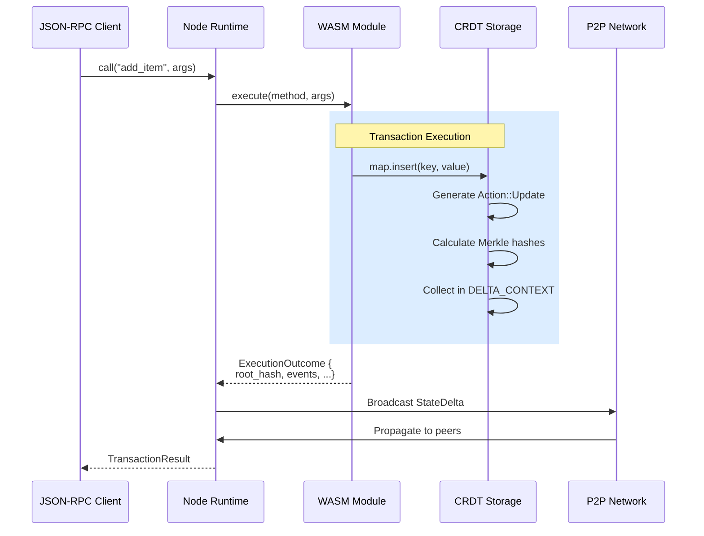

# Applications

Calimero **applications** are WASM (WebAssembly) modules that run inside the Calimero node runtime. They use the Calimero SDK to manage CRDT-backed state, emit events, and interact with the network.

## Application Model

Applications are compiled from Rust (or other supported languages) to WebAssembly and executed in a sandboxed environment. They use the Calimero SDK to:

- Define **state** using CRDT collections
- Implement **logic** that mutates state
- Emit **events** for real-time updates
- Access **private storage** for node-local data

## Quick Start

See [`core/crates/sdk/README.md`](https://github.com/calimero-network/core/blob/master/crates/sdk/README.md) for complete SDK documentation.

**Minimal example:**

```rust
use calimero_sdk::app;
use calimero_storage::collections::UnorderedMap;

#[app::state]
pub struct MyApp {
    items: UnorderedMap<String, String>,
}

#[app::logic]
impl MyApp {
    pub fn add_item(&mut self, key: String, value: String) {
        self.items.insert(key, value);
    }
}
```

Build and deploy with [`meroctl`](../tools-apis/meroctl-cli.md). See [SDK Guide](../builder-directory/sdk-guide.md) for details.

## Architecture

### WASM Execution Flow



### Execution Model

1. **Deterministic execution**: WASM code runs deterministically for consistent results across nodes
2. **Sandboxing**: Isolated execution environment with resource limits
3. **State mutation**: CRDT operations generate actions that are collected in DELTA_CONTEXT
4. **Event emission**: Applications can emit events for real-time updates

## CRDT State Management

Applications use CRDT collections for conflict-free state. See [`core/crates/storage/README.md`](https://github.com/calimero-network/core/blob/master/crates/storage/README.md) for complete CRDT documentation.

**Available collections:**
- `Counter` - Distributed counters (sum)
- `LwwRegister<T>` - Last-write-wins registers
- `UnorderedMap<K,V>` - Key-value maps
- `Vector<T>` - Ordered lists
- `UnorderedSet<T>` - Unique sets (union)
- `Option<T>` - Optional CRDTs

CRDTs can be nested arbitrarily for complex data structures.

## Event System

Applications emit events for real-time updates. Events propagate to all peers automatically.

**Event lifecycle:**
1. Emitted during method execution
2. Broadcast to all peers via delta
3. Handlers execute on peer nodes
4. Handlers can update state or trigger side effects

See [`core/crates/sdk/README.md`](https://github.com/calimero-network/core/blob/master/crates/sdk/README.md) for event examples.

## Private Storage

For node-local data (secrets, caches) that never syncs across nodes:

```rust
use calimero_sdk::private_storage;

let secrets = private_storage::entry::<Secrets>("my-secrets");
secrets.write(|s| { s.token = "rotated".to_string(); });
```

See [`core/crates/sdk/README.md`](https://github.com/calimero-network/core/blob/master/crates/sdk/README.md) for private storage details.

## Views vs Mutations

Mark read-only methods with `#[app::view]` to skip persistence:

```rust
#[app::view]  // Read-only, no delta generated
pub fn get_item(&self, key: &str) -> Option<String> {
    self.items.get(key)
}
```
```

**Benefits**:
- Views don't generate storage deltas
- Faster execution (no persistence overhead)
- Clear intent in API

## Resource Limits

WASM execution is bounded:

- **Memory**: Configurable limits (default: ~128MB)
- **Stack size**: Bounded to prevent stack overflow
- **Execution time**: Metered with gas-like system
- **Register limits**: Number and size of storage registers

See [`core/crates/runtime/README.md`](https://github.com/calimero-network/core/blob/master/crates/runtime/README.md) for detailed limits.

## ABI Generation

Applications export an ABI (Application Binary Interface) that clients use:

1. **Build WASM**: Compile Rust code to WASM
2. **Generate ABI**: Extract method signatures, types, events
3. **Client bindings**: Generate TypeScript/Python clients from ABI
4. **Type safety**: Full type information for client calls

Tools:
- **`calimero-abi`**: Rust tool for ABI generation
- **`@calimero/abi-codegen`**: TypeScript client generator

## Example Applications

- **kv-store**: Simple key-value store ([`core/apps/kv-store`](https://github.com/calimero-network/core/tree/master/apps/kv-store))
- **blobs**: File/blob sharing ([`core/apps/blobs`](https://github.com/calimero-network/core/tree/master/apps/blobs))
- **battleships**: Multiplayer game ([`battleships`](https://github.com/calimero-network/battleships))

## Deep Dives

For detailed application development:

- **SDK Documentation**: [`core/crates/sdk/README.md`](https://github.com/calimero-network/core/blob/master/crates/sdk/README.md) - API reference and examples
- **Storage Collections**: [`core/crates/storage/README.md`](https://github.com/calimero-network/core/blob/master/crates/storage/README.md) - CRDT types and merge semantics
- **Runtime**: [`core/crates/runtime/README.md`](https://github.com/calimero-network/core/blob/master/crates/runtime/README.md) - WASM execution engine
- **Integration Guide**: [`core/crates/node/readme/integration-guide.md`](https://github.com/calimero-network/core/blob/master/crates/node/readme/integration-guide.md) - Building applications

## Related Topics

- [Build Your First Application](../getting-started/build-your-first-application.md) - Step-by-step guide
- [Contexts](contexts.md) - Application instances
- [Architecture Overview](architecture.md) - How applications fit into the system
