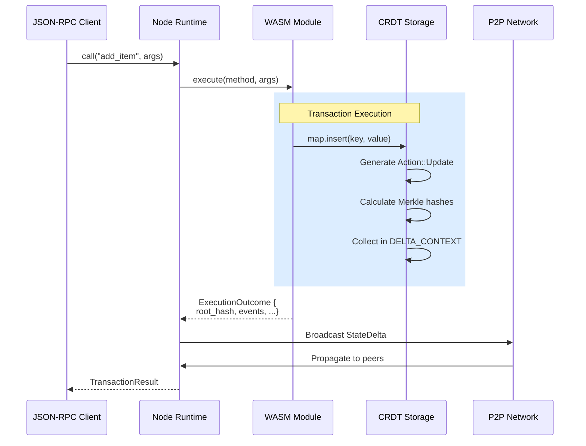

# Applications

Calimero **applications** are WASM (WebAssembly) modules that run inside the Calimero node runtime. They use the Calimero SDK to manage CRDT-backed state, emit events, and interact with the network.

## Application Model

Applications are compiled from Rust (or other supported languages) to WebAssembly and executed in a sandboxed environment. They use the Calimero SDK to:

- Define **state** using CRDT collections
- Implement **logic** that mutates state
- Emit **events** for real-time updates
- Access **private storage** for node-local data

## Quick Start

```rust
use calimero_sdk::app;
use calimero_storage::collections::UnorderedMap;

#[app::state]
#[derive(BorshSerialize, BorshDeserialize)]
pub struct MyApp {
    items: UnorderedMap<String, String>,
}

#[app::logic]
impl MyApp {
    #[app::init]
    pub fn init() -> MyApp {
        MyApp {
            items: UnorderedMap::new(),
        }
    }
    
    pub fn add_item(&mut self, key: String, value: String) -> app::Result<()> {
        self.items.insert(key, value)?;
        Ok(())
    }
    
    pub fn get_item(&self, key: &str) -> app::Result<Option<String>> {
        self.items.get(key).map_err(Into::into)
    }
}
```

Build and deploy:

```bash
# Build WASM
./build.sh

# Install on node
meroctl --node-name node1 app install \
  --path build/app.wasm \
  --context-id <CONTEXT_ID>
```

## Architecture

### WASM Execution Flow



### Execution Model

1. **Deterministic execution**: WASM code runs deterministically for consistent results across nodes
2. **Sandboxing**: Isolated execution environment with resource limits
3. **State mutation**: CRDT operations generate actions that are collected in DELTA_CONTEXT
4. **Event emission**: Applications can emit events for real-time updates

## CRDT State Management

Applications use CRDT collections for conflict-free state:

### Available Collections

| Collection | Use Case | Merge Strategy |
| --- | --- | --- |
| **Counter** | Metrics, counters | Sum |
| **LwwRegister&lt;T&gt;** | Single values | Latest timestamp |
| **UnorderedMap&lt;K,V&gt;** | Key-value storage | Recursive per-entry |
| **Vector&lt;T&gt;** | Ordered lists | Element-wise |
| **UnorderedSet&lt;T&gt;** | Unique values | Union |
| **Option&lt;T&gt;** | Optional CRDTs | Recursive if Some |

### Nested Structures

CRDTs can be nested arbitrarily:

```rust
#[app::state]
pub struct TeamMetrics {
    // Map of team member → Map of metric → Counter
    member_metrics: UnorderedMap<String, UnorderedMap<String, Counter>>,
}
```

## Event System

Applications can emit events for real-time updates:

```rust
#[app::state(emits = ItemAdded)]
pub struct MyApp {
    items: UnorderedMap<String, String>,
}

#[derive(BorshSerialize, BorshDeserialize)]
pub struct ItemAdded {
    key: String,
    value: String,
}

#[app::logic]
impl MyApp {
    pub fn add_item(&mut self, key: String, value: String) -> app::Result<()> {
        self.items.insert(key.clone(), value.clone())?;
        app::emit(ItemAdded { key, value })?;
        Ok(())
    }
}
```

**Event lifecycle**:
1. Emitted during method execution
2. Included in delta broadcast to all peers
3. Event handlers execute on peer nodes (not author node)
4. Handlers can update UI or trigger side effects

## Private Storage

For node-local data (secrets, caches, per-node counters):

```rust
use calimero_sdk::private_storage;

pub fn use_private_storage() {
    let secrets = private_storage::entry::<Secrets>("my-secrets");
    secrets.write(|s| {
        s.token = "rotated-token".to_string();
    });
}
```

**Key properties**:
- Not replicated across nodes
- Stored via `storage_read` / `storage_write` directly
- Never included in CRDT deltas
- Accessible only on the executing node

## Views vs Mutations

Mark read-only methods with `#[app::view]`:

```rust
#[app::logic]
impl MyApp {
    // Mutation - persists state changes
    pub fn add_item(&mut self, key: String, value: String) -> app::Result<()> {
        self.items.insert(key, value)?;
        Ok(())
    }
    
    // View - read-only, skips persistence
    #[app::view]
    pub fn get_item(&self, key: &str) -> app::Result<Option<String>> {
        self.items.get(key).map_err(Into::into)
    }
}
```

**Benefits**:
- Views don't generate storage deltas
- Faster execution (no persistence overhead)
- Clear intent in API

## Resource Limits

WASM execution is bounded:

- **Memory**: Configurable limits (default: ~128MB)
- **Stack size**: Bounded to prevent stack overflow
- **Execution time**: Metered with gas-like system
- **Register limits**: Number and size of storage registers

See [`core/crates/runtime/README.md`](https://github.com/calimero-network/core/blob/master/crates/runtime/README.md) for detailed limits.

## ABI Generation

Applications export an ABI (Application Binary Interface) that clients use:

1. **Build WASM**: Compile Rust code to WASM
2. **Generate ABI**: Extract method signatures, types, events
3. **Client bindings**: Generate TypeScript/Python clients from ABI
4. **Type safety**: Full type information for client calls

Tools:
- **`calimero-abi`**: Rust tool for ABI generation
- **`@calimero/abi-codegen`**: TypeScript client generator

## Example Applications

- **kv-store**: Simple key-value store ([`core/apps/kv-store`](https://github.com/calimero-network/core/tree/master/apps/kv-store))
- **blobs**: File/blob sharing ([`core/apps/blobs`](https://github.com/calimero-network/core/tree/master/apps/blobs))
- **battleships**: Multiplayer game ([`battleships`](https://github.com/calimero-network/battleships))

## Deep Dives

For detailed application development:

- **SDK Documentation**: [`core/crates/sdk/README.md`](https://github.com/calimero-network/core/blob/master/crates/sdk/README.md) - API reference and examples
- **Storage Collections**: [`core/crates/storage/README.md`](https://github.com/calimero-network/core/blob/master/crates/storage/README.md) - CRDT types and merge semantics
- **Runtime**: [`core/crates/runtime/README.md`](https://github.com/calimero-network/core/blob/master/crates/runtime/README.md) - WASM execution engine
- **Integration Guide**: [`core/crates/node/readme/integration-guide.md`](https://github.com/calimero-network/core/blob/master/crates/node/readme/integration-guide.md) - Building applications

## Related Topics

- [Build Your First Application](getting-started/build-your-first-application.md) - Step-by-step guide
- [Contexts](contexts.md) - Application instances
- [Architecture Overview](architecture.md) - How applications fit into the system
