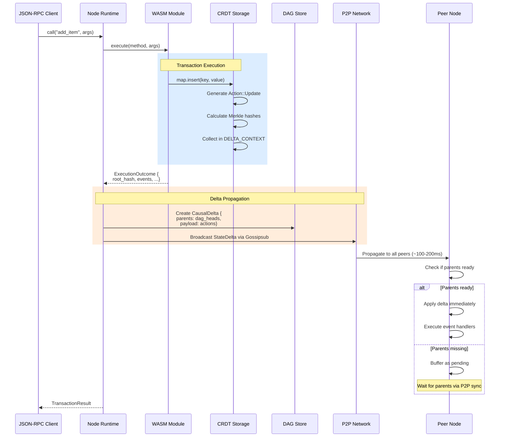
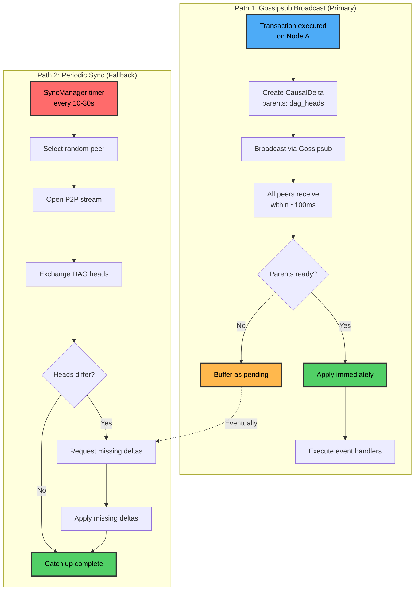
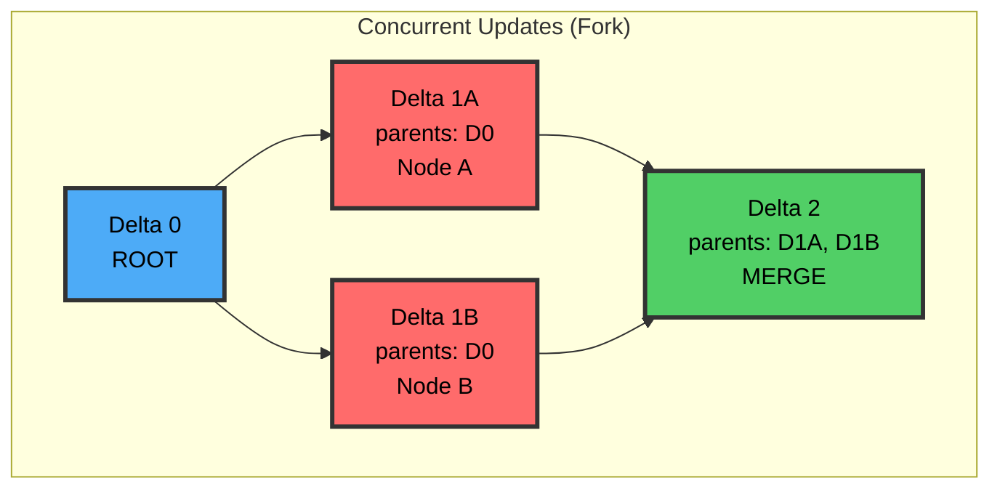

# Architecture Overview

Calimero's architecture consists of four main layers that work together to enable distributed, peer-to-peer applications with automatic conflict-free synchronization.

## Four-Layer Architecture

```
┌─────────────────────────────────────────────────────────┐
│ 1. Application Layer                                    │
│    - WASM apps using Calimero SDK                       │
│    - CRDT collections (UnorderedMap, Vector, Counter)   │
│    - Event emission for real-time updates               │
└────────────────────────┬────────────────────────────────┘
                         │
┌────────────────────────┴────────────────────────────────┐
│ 2. Node Layer                                           │
│    - Orchestrates synchronization & execution           │
│    - Dual sync paths: Gossipsub + Periodic P2P         │
│    - Event handler execution                            │
│    - Blob distribution                                  │
└────────────────────────┬────────────────────────────────┘
                         │
┌────────────────────────┴────────────────────────────────┐
│ 3. Storage Layer                                        │
│    - CRDT storage with automatic merging                │
│    - DAG for causal ordering                            │
│    - Out-of-order delivery handling                     │
│    - Merkle trees for state comparison                  │
└────────────────────────┬────────────────────────────────┘
                         │
┌────────────────────────┴────────────────────────────────┐
│ 4. Network Layer                                        │
│    - libp2p (Gossipsub, Streams, DHT)                   │
│    - JSON-RPC server                                    │
│    - WebSocket/SSE subscriptions                        │
│    - Authentication & authorization                     │
└─────────────────────────────────────────────────────────┘
```

## Transaction Flow

Here's how a transaction flows through the system:



## Synchronization Flow

Calimero uses a dual-path synchronization strategy:

### Path 1: Gossipsub Broadcast (Primary)
- **Speed**: ~100-200ms latency
- **Reliability**: Excellent in good network conditions
- **Purpose**: Fast, real-time propagation of changes
- **How it works**: Delta broadcast to all peers in the Gossipsub mesh

### Path 2: Periodic P2P Sync (Fallback)
- **Speed**: Every 10-30 seconds
- **Reliability**: Ensures eventual consistency
- **Purpose**: Catch-up after network issues, downtime, or packet loss
- **How it works**: Direct P2P stream exchange of missing deltas



**Why both paths?**
- **Gossipsub**: Fast (~100-200ms), reliable in good network conditions
- **Periodic sync**: Ensures eventual consistency even with packet loss, partitions, or downtime

## DAG-Based Causal Ordering

The DAG (Directed Acyclic Graph) ensures that deltas are applied in the correct causal order, even when received out-of-order:



**Key properties**:
- Deltas can arrive in any order
- System buffers deltas until their parent dependencies are ready
- Once parents are available, deltas are applied automatically in causal order
- Concurrent updates create forks that merge automatically

## Component Map

| Component | Purpose | Responsibility | Location |
| --- | --- | --- | --- |
| **Application SDK** | Macro system (`#[app::state]`, `#[app::logic]`), CRDT collections, event emission | Provides developer API for building WASM applications | `crates/sdk` |
| **Runtime** | WASM execution engine (Wasmer), sandboxing, resource limits | Executes WASM modules safely with bounded resources | `crates/runtime` |
| **Storage** | CRDT collections with merge semantics | Manages conflict-free data types and automatic merging | `crates/storage` |
| **DAG** | Pure DAG for causal delta tracking, dependency resolution | Ensures deltas are applied in correct causal order | `crates/dag` |
| **Node** | NodeManager orchestrates sync, events, blob sharing | Coordinates all node operations (sync, events, blobs) | `crates/node` |
| **Network** | libp2p integration for P2P communication | Handles P2P networking (Gossipsub, streams, DHT) | `crates/network` |
| **Server** | JSON-RPC API, WebSocket/SSE subscriptions, admin endpoints | Exposes APIs for clients and admin operations | `crates/server` |
| **Auth** | Authentication and identity management | Handles wallet-based auth and JWT token issuance | `crates/auth` |
| **Store** | Persistent storage backend (RocksDB) | Provides durable storage for contexts and state | `crates/store` |
| **Context** | Context (application instance) lifecycle management | Manages context creation, membership, and operations | `crates/context` |
| **merod** | Node binary (coordinator or peer) | Main executable for running Calimero nodes | `crates/merod` |
| **meroctl** | CLI for node operations, app installation, calls | Command-line interface for node management | `crates/meroctl` |

## Key Components Deep Dive

### Application SDK (`crates/sdk`)

**What it does:**
- Provides macros (`#[app::state]`, `#[app::logic]`, `#[app::init]`) for defining application structure
- Exposes CRDT collections (UnorderedMap, Vector, Counter, etc.) for state management
- Handles event emission and collection
- Manages private storage for node-local data

**Why it matters:**
- Simplifies application development with declarative macros
- Ensures correct CRDT usage patterns
- Abstracts away low-level storage details

**Key concepts:**
- State structs define persisted data
- Logic structs implement methods
- Views vs mutations (read-only vs state-changing)
- Event emission for real-time updates

### Runtime (`crates/runtime`)

**What it does:**
- Executes WASM modules using Wasmer
- Enforces resource limits (memory, stack, execution time)
- Provides host functions (storage, logging, crypto, HTTP)
- Handles deterministic execution

**Why it matters:**
- Sandboxes untrusted code safely
- Prevents resource exhaustion
- Enables consistent execution across nodes

**Key concepts:**
- VMLogic: Central execution context
- Host functions: Bridge between WASM and host
- Resource metering: Gas-like system for execution limits

### Storage (`crates/storage`)

**What it does:**
- Implements CRDT collections (UnorderedMap, Vector, Counter, LwwRegister, etc.)
- Handles automatic merging of concurrent updates
- Manages Merkle trees for efficient state comparison
- Provides snapshot and delta generation

**Why it matters:**
- Enables conflict-free synchronization
- Handles concurrent updates automatically
- Efficient state comparison for sync

**Key concepts:**
- CRDT semantics: Each collection type has specific merge behavior
- Nested structures: CRDTs can be nested arbitrarily
- Action generation: State changes generate actions for delta propagation

### DAG (`crates/dag`)

**What it does:**
- Tracks causal relationships between deltas
- Buffers deltas until parent dependencies are ready
- Applies deltas in correct causal order
- Detects and handles forks

**Why it matters:**
- Handles out-of-order network delivery
- Ensures consistent state across nodes
- Enables concurrent updates without conflicts

**Key concepts:**
- CausalDelta: Delta with parent references
- DagStore: Manages delta graph
- Pending deltas: Buffered until parents arrive
- DAG heads: Current tips of the graph

### Node (`crates/node`)

**What it does:**
- Orchestrates all node operations (NodeManager)
- Manages delta propagation (Gossipsub + P2P sync)
- Executes event handlers on peer nodes
- Distributes blobs via content-addressed storage

**Why it matters:**
- Central coordination point for all node activities
- Ensures reliable synchronization
- Enables real-time event handling

**Key concepts:**
- NodeManager: Main orchestrator (Actix Actor)
- DeltaStore: Wraps DAG with WASM execution
- SyncManager: Coordinates periodic sync
- BlobManager: Manages blob cache and distribution

### Network (`crates/network`)

**What it does:**
- Integrates libp2p for P2P communication
- Manages Gossipsub mesh for broadcast
- Handles P2P streams for direct communication
- Provides DHT for peer discovery

**Why it matters:**
- Enables decentralized communication
- Fast broadcast for real-time updates
- Reliable streams for catch-up sync

**Key concepts:**
- Gossipsub: Pub/sub for delta broadcast
- P2P streams: Direct peer-to-peer communication
- DHT: Distributed hash table for peer discovery
- Noise encryption: Secure communication

### Server (`crates/server`)

**What it does:**
- Exposes JSON-RPC API for client interaction
- Provides WebSocket and SSE for real-time subscriptions
- Handles admin API endpoints
- Manages authentication and authorization

**Why it matters:**
- Enables client applications to interact with nodes
- Provides real-time updates via subscriptions
- Allows administrative operations

**Key concepts:**
- JSON-RPC: Standard RPC protocol
- WebSocket/SSE: Real-time event streaming
- Admin API: Node management operations
- Authentication: JWT-based access control

## Deep Dives

For detailed architecture information:

- **DAG Logic**: [`core/crates/dag/README.md`](https://github.com/calimero-network/core/blob/master/crates/dag/README.md) - Causal ordering algorithms
- **Node Architecture**: [`core/crates/node/readme/architecture.md`](https://github.com/calimero-network/core/blob/master/crates/node/readme/architecture.md) - Complete system design
- **Sync Protocol**: [`core/crates/node/readme/sync-protocol.md`](https://github.com/calimero-network/core/blob/master/crates/node/readme/sync-protocol.md) - Delta propagation details
- **Storage**: [`core/crates/storage/README.md`](https://github.com/calimero-network/core/blob/master/crates/storage/README.md) - CRDT types and merge semantics
- **Network**: [`core/crates/network/README.md`](https://github.com/calimero-network/core/blob/master/crates/network/README.md) - P2P protocols and configuration

---

**Next**: Learn about specific concepts: [Contexts](contexts.md) | [Identity](identity.md) | [Applications](applications.md) | [Nodes](nodes.md)
