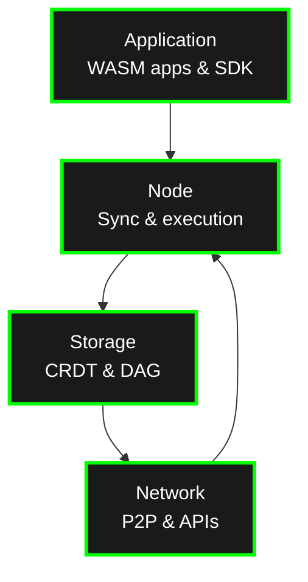
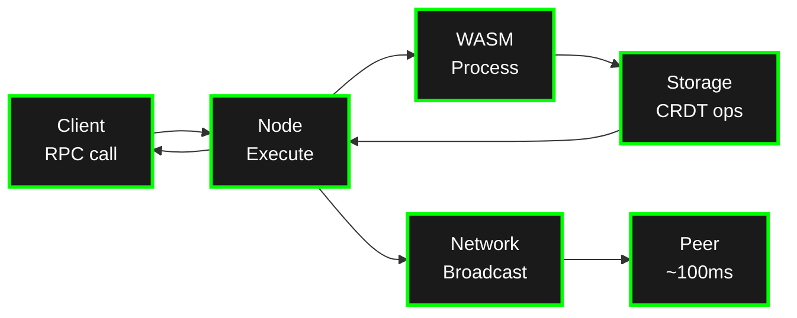
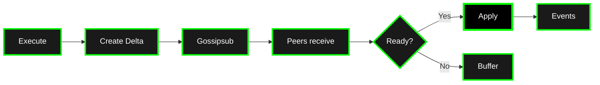
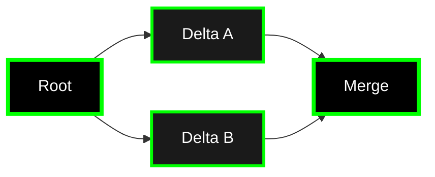
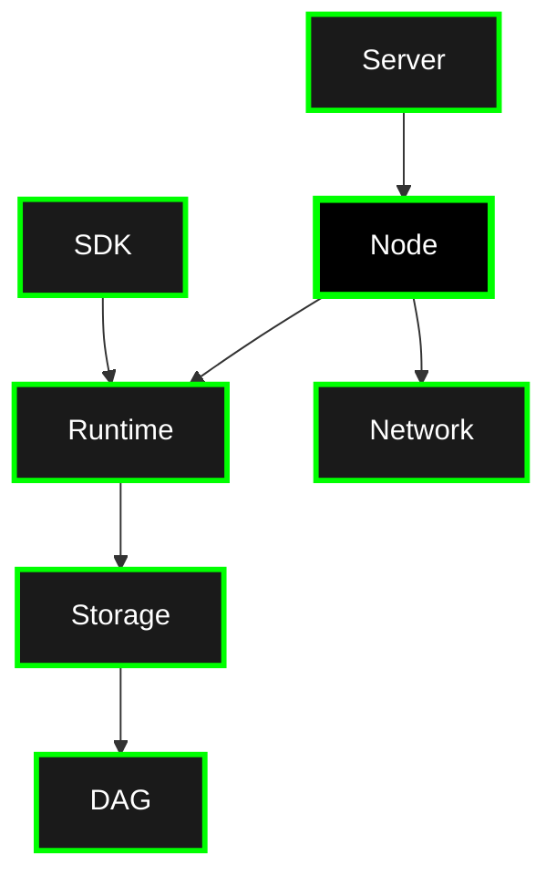

# Architecture Overview

Calimero's architecture consists of four main layers that work together to enable distributed, peer-to-peer applications with automatic conflict-free synchronization.

## Four-Layer Architecture

## Transaction Flow

**Transaction Flow:**

See [`core/crates/runtime/README.md`](https://github.com/calimero-network/core/blob/master/crates/runtime/README.md) for execution details.

## Synchronization Flow

Calimero uses a dual-path synchronization strategy:

### Path 1: Gossipsub Broadcast (Primary)

Fast real-time propagation (~100-200ms):

### Path 2: Periodic P2P Sync (Fallback)

Catch-up every 10-30 seconds:

```mermaid
flowchart LR
    TIMER[Timer] --> PEER[Select Peer]
    PEER --> STREAM[Open Stream]
    STREAM --> HEADS[Exchange Heads]
    HEADS --> DIFF{Differ?}
    DIFF -->|Yes| REQUEST[Request Deltas]
    DIFF -->|No| SYNC[Synced]
    REQUEST --> APPLY2[Apply]
    APPLY2 --> SYNC
    
    style TIMER fill:#1a1a1a,stroke:#00ff00,stroke-width:3px,color:#ffffff
    style PEER fill:#1a1a1a,stroke:#00ff00,stroke-width:3px,color:#ffffff
    style STREAM fill:#1a1a1a,stroke:#00ff00,stroke-width:3px,color:#ffffff
    style HEADS fill:#1a1a1a,stroke:#00ff00,stroke-width:3px,color:#ffffff
    style DIFF fill:#1a1a1a,stroke:#00ff00,stroke-width:3px,color:#ffffff
    style REQUEST fill:#1a1a1a,stroke:#00ff00,stroke-width:3px,color:#ffffff
    style APPLY2 fill:#1a1a1a,stroke:#00ff00,stroke-width:3px,color:#ffffff
    style SYNC fill:#000000,stroke:#00ff00,stroke-width:4px,color:#ffffff
```

**Why both paths?**
- **Gossipsub**: Fast (~100-200ms), reliable in good network conditions
- **Periodic sync**: Ensures eventual consistency even with packet loss, partitions, or downtime

See [`core/crates/node/README.md`](https://github.com/calimero-network/core/blob/master/crates/node/README.md) for sync configuration details.

## DAG-Based Causal Ordering

The DAG ensures deltas are applied in correct causal order:

**Key properties**:
- Deltas can arrive in any order
- System buffers deltas until their parent dependencies are ready
- Once parents are available, deltas are applied automatically in causal order
- Concurrent updates create forks that merge automatically

## Key Components

| Component | Purpose | Repository |
| --- | --- | --- |
| **SDK** | `#[app::state]`, `#[app::logic]`, CRDT collections, events | [`core/crates/sdk`](https://github.com/calimero-network/core/blob/master/crates/sdk) |
| **Runtime** | WASM execution (Wasmer), sandboxing | [`core/crates/runtime`](https://github.com/calimero-network/core/blob/master/crates/runtime) |
| **Storage** | CRDT collections, merge semantics | [`core/crates/storage`](https://github.com/calimero-network/core/blob/master/crates/storage) |
| **DAG** | Causal delta tracking, dependency resolution | [`core/crates/dag`](https://github.com/calimero-network/core/blob/master/crates/dag) |
| **Node** | NodeManager orchestrates sync, events, blobs | [`core/crates/node`](https://github.com/calimero-network/core/blob/master/crates/node) |
| **Network** | libp2p P2P (Gossipsub, streams, DHT) | [`core/crates/network`](https://github.com/calimero-network/core/blob/master/crates/network) |
| **Server** | JSON-RPC API, WebSocket/SSE | [`core/crates/server`](https://github.com/calimero-network/core/blob/master/crates/server) |
| **merod** | Node binary (coordinator/peer) | [`core/crates/merod`](https://github.com/calimero-network/core/blob/master/crates/merod) |
| **meroctl** | CLI for node operations | [`core/crates/meroctl`](https://github.com/calimero-network/core/blob/master/crates/meroctl) |

See [`core/README.md`](https://github.com/calimero-network/core#readme) for complete architecture.

## Component Details

For detailed information on each component, see their README files:

- **SDK**: [`core/crates/sdk/README.md`](https://github.com/calimero-network/core/blob/master/crates/sdk/README.md) - Macros, CRDTs, events
- **Runtime**: [`core/crates/runtime/README.md`](https://github.com/calimero-network/core/blob/master/crates/runtime/README.md) - WASM execution, sandboxing
- **Storage**: [`core/crates/storage/README.md`](https://github.com/calimero-network/core/blob/master/crates/storage/README.md) - CRDT collections, merging
- **DAG**: [`core/crates/dag/README.md`](https://github.com/calimero-network/core/blob/master/crates/dag/README.md) - Causal ordering, dependency resolution
- **Node**: [`core/crates/node/README.md`](https://github.com/calimero-network/core/blob/master/crates/node/README.md) - NodeManager, sync, events
- **Network**: [`core/crates/network/README.md`](https://github.com/calimero-network/core/blob/master/crates/network/README.md) - libp2p, Gossipsub, P2P
- **Server**: [`core/crates/server/README.md`](https://github.com/calimero-network/core/blob/master/crates/server/README.md) - JSON-RPC, WebSocket, SSE

## Deep Dives

For detailed architecture information:

- **DAG Logic**: [`core/crates/dag/README.md`](https://github.com/calimero-network/core/blob/master/crates/dag/README.md) - Causal ordering algorithms
- **Node Architecture**: [`core/crates/node/readme/architecture.md`](https://github.com/calimero-network/core/blob/master/crates/node/readme/architecture.md) - Complete system design
- **Sync Protocol**: [`core/crates/node/readme/sync-protocol.md`](https://github.com/calimero-network/core/blob/master/crates/node/readme/sync-protocol.md) - Delta propagation details
- **Storage**: [`core/crates/storage/README.md`](https://github.com/calimero-network/core/blob/master/crates/storage/README.md) - CRDT types and merge semantics
- **Network**: [`core/crates/network/README.md`](https://github.com/calimero-network/core/blob/master/crates/network/README.md) - P2P protocols and configuration

---

**Next**: Learn about specific concepts: [Contexts](contexts.md) | [Identity](identity.md) | [Applications](applications.md) | [Nodes](nodes.md)
