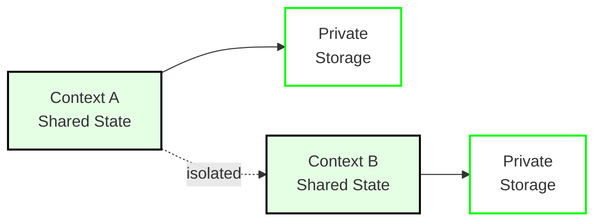

# Contexts

A **context** is an isolated instance of an application running on the Calimero network. Each context has its own state, members, and access controls. Think of it as a "workspace" or "room" where a specific application instance operates.

## What Are Contexts?

Contexts provide:

- **State Isolation**: Each context maintains its own CRDT-backed state, completely separate from other contexts
- **Member Management**: Invite-only access control with cryptographic identities
- **Multi-Chain Support**: Each context can be associated with a blockchain protocol (NEAR, Ethereum, ICP, etc.)
- **Lifecycle Management**: Create, invite members, join, and manage contexts independently

## Context Lifecycle


### 1. Creation

A context is created when an application is installed. See [`core/crates/meroctl/README.md`](https://github.com/calimero-network/core/blob/master/crates/meroctl/README.md) for CLI details.

**What happens:**
- Application WASM is installed on the node
- Initial context state is created (via `#[app::init]` method)
- Context creator becomes the first member
- Context ID is generated (unique identifier)

### 2. Invitation Flow

Context creators can invite other identities to join:

```bash
# Generate identity for invitee
meroctl identity create --node-name node2

# Create invitation
meroctl context invite \
  --context-id <CONTEXT_ID> \
  --grantee-id <PUBLIC_KEY>
```

**Invitation contains:**
- Context ID
- Grantee public key
- Permissions (read/write/execute)
- Expiration (optional)

### 3. Joining a Context

Invited members can join using the invitation:

```bash
# Join context using invitation
meroctl context join \
  --context-id <CONTEXT_ID> \
  --invitation <INVITATION_DATA>
```

**What happens:**
- Invitation is validated
- Member is added to context membership
- Member receives current state snapshot
- Member can now call methods and receive updates

### 4. Membership & Permissions

Context members have different permission levels:

- **Creator**: Full control, can invite/revoke members
- **Member**: Can call methods, read state, receive events
- **Read-only**: Can query state but cannot mutate

## State Isolation Model



**Key points:**
- **Shared CRDT State**: Replicated across all member nodes, automatically synchronized
- **Private Storage**: Node-local data that never leaves the executing node
- **Complete Isolation**: Context A cannot access Context B's state

See [`core/crates/storage/README.md`](https://github.com/calimero-network/core/blob/master/crates/storage/README.md) for CRDT implementation details.

## Multi-Chain Integration

Contexts can be associated with blockchain protocols:

| Protocol | Use Case | Identity Source |
| --- | --- | --- |
| **NEAR** | NEAR-based applications | NEAR account IDs |
| **Ethereum** | Ethereum dApps | Ethereum addresses |
| **ICP** | Internet Computer apps | ICP principals |
| **Stellar** | Stellar-based apps | Stellar accounts |

Each protocol provides:
- **Identity verification**: Cryptographic proof of ownership
- **Cross-chain attestations**: Verifiable claims about on-chain state
- **Relayer integration**: Bridge between Calimero and blockchain

## Context Operations

**Query state:**
```bash
meroctl call --context-id <CONTEXT_ID> --method get_item --args '{"key": "hello"}'
```

**Mutate state:**
```bash
meroctl call --context-id <CONTEXT_ID> --method add_item --args '{"key": "hello", "value": "world"}' --executor-public-key <KEY>
```

**Subscribe to events:**
- WebSocket: Connect to `ws://localhost:2528/ws`
- Use `subscribe` method with `context_id` and `event_type`
- See [API Reference](../reference/index.md) for details

See [`core/crates/meroctl/README.md`](https://github.com/calimero-network/core/blob/master/crates/meroctl/README.md) for complete CLI documentation.

## Context Management

**List contexts:**
```bash
meroctl context list
```

**Revoke access:**
```bash
meroctl context revoke --context-id <CONTEXT_ID> --member-id <PUBLIC_KEY>
```

Revoking access removes the member but preserves state history.

## Best Practices

1. **One Context Per Use Case**: Create separate contexts for different purposes (e.g., one per team, one per project)
2. **Minimize Members**: Only invite necessary members to reduce sync overhead
3. **Use Private Storage**: Store secrets and node-local data in private storage, not CRDT state
4. **Context Naming**: Use descriptive context IDs or metadata for easier management

## Deep Dives

For detailed context documentation:

- **Context Management**: [`core/crates/context/README.md`](https://github.com/calimero-network/core/blob/master/crates/context/README.md) - Lifecycle and operations
- **Identity & Permissions**: [Identity](identity.md) - Cryptographic identities and access control
- **Merobox Workflows**: [`merobox` README](https://github.com/calimero-network/merobox#readme) - Automated context creation and management

## Related Topics

- [Applications](applications.md) - What runs inside contexts
- [Identity](identity.md) - Who can access contexts
- [Nodes](nodes.md) - Where contexts run
- [Architecture Overview](architecture.md) - How contexts fit into the system
