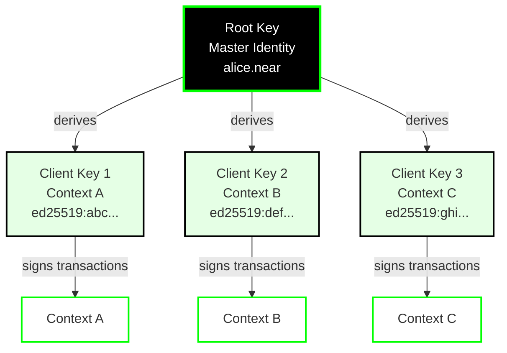

# Identity

Calimero uses **cryptographic identities** to manage access control and authentication across the network. Each participant has one or more identities that prove ownership and grant permissions.

## Identity Model

Calimero supports a hierarchical identity model:



### Root Keys

A **root key** is the master identity for a user or node. It's typically:

- Generated from a blockchain wallet (NEAR, Ethereum, etc.)
- Used for high-level operations (creating contexts, managing memberships)
- Stored securely (hardware wallet, keychain, etc.)

### Client Keys

**Client keys** are derived from root keys and used for:

- Executing methods in specific contexts
- Signing transactions and deltas
- Proving membership in contexts

**Benefits:**
- **Isolation**: Compromise of one client key doesn't affect others
- **Revocation**: Can revoke access per-context without changing root key
- **Privacy**: Different keys for different contexts

## Identity Generation

Generate identities with `meroctl`:

```bash
meroctl identity create --node-name node1
```

See [`core/crates/meroctl/README.md`](https://github.com/calimero-network/core/blob/master/crates/meroctl/README.md) for CLI details.

## Blockchain Wallet Integration

Calimero supports wallet-based authentication:

| Protocol | Identity Source |
| --- | --- |
| **NEAR** | NEAR account ID + signature |
| **Ethereum** | Ethereum address + signature |
| **ICP** | ICP principal + signature |
| **Stellar** | Stellar account + signature |

**Flow:**
1. User connects wallet
2. Signs challenge message
3. Calimero verifies signature
4. JWT token issued

See [`calimero-client-js/README.md`](https://github.com/calimero-network/calimero-client-js#readme) for client authentication examples.

## Authentication Flows

For wallet authentication examples, see:
- **JavaScript**: [`calimero-client-js/README.md`](https://github.com/calimero-network/calimero-client-js#readme) - Client-side auth flows
- **Python**: [`calimero-client-py/README.md`](https://github.com/calimero-network/calimero-client-py#readme) - Python client auth

## JWT Tokens

After authentication, Calimero issues JWT tokens containing:
- `context_id` - Target context
- `executor_public_key` - Client key for execution
- `permissions` - Access permissions
- `exp` - Expiration timestamp

**Usage:**
- Include in API requests: `Authorization: Bearer <token>`
- Tokens expire and can be refreshed
- See [`core/crates/auth/README.md`](https://github.com/calimero-network/core/blob/master/crates/auth/README.md) for details

## Key Management

**Hierarchical structure:**
- Root keys delegate to client keys per context
- Each context has separate client keys
- Keys can be revoked independently

**Revoke access:**
```bash
meroctl context revoke --context-id <CONTEXT_ID> --member-id <PUBLIC_KEY>
```

See [`core/crates/meroctl/README.md`](https://github.com/calimero-network/core/blob/master/crates/meroctl/README.md) for key management commands.

**What happens:**
- Key is removed from context membership
- Key can no longer sign transactions for that context
- Existing transactions remain valid (immutable history)
- Root key remains unaffected

## Wallet Adapters

Calimero provides wallet adapters for easy integration:

### JavaScript Client

```typescript
import { ClientLogin } from '@calimero-network/calimero-client';

// Automatically handles wallet connection and authentication
<ClientLogin 
  successRedirect={() => navigate('/dashboard')}
/>
```

**Supported wallets:**
- NEAR Wallet
- MetaMask (Ethereum)
- WalletConnect
- Internet Identity (ICP)

### Python Client

```python
from calimero_client_py import create_connection, AuthMode

# Connect with wallet authentication
connection = create_connection(
    base_url="https://node.calimero.network",
    auth_mode=AuthMode.WALLET,
    wallet_type="near"  # or "ethereum", "icp"
)
```

## Best Practices

1. **Use Client Keys**: Don't use root keys directly for context operations
2. **Rotate Keys**: Periodically rotate client keys for security
3. **Secure Storage**: Store private keys in secure keychains, never in code
4. **Multi-Sig Support**: Use multi-signature wallets for high-value contexts
5. **Key Backup**: Backup root keys securely (hardware wallet, paper backup)

## Deep Dives

For detailed identity documentation:

- **Identity Contracts**: [`contracts` README](https://github.com/calimero-network/contracts#readme) - Smart contract implementations
- **Auth Service**: [`core/crates/auth/README.md`](https://github.com/calimero-network/core/blob/master/crates/auth/README.md) - Authentication service
- **Client SDKs**: [Tools & APIs](../tools-apis/index.md) - Wallet integration guides

## Related Topics

- [Contexts](contexts.md) - Where identities are used
- [Applications](applications.md) - What identities can access
- [Architecture Overview](architecture.md) - How identity fits into the system
