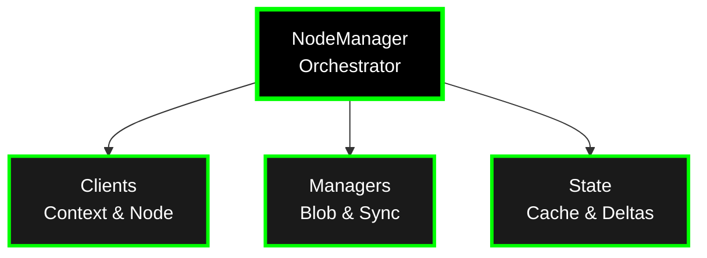

# Nodes

A **node** (`merod`) is the core runtime that orchestrates synchronization, event handling, and blob distribution across a distributed network of peers. It wraps the DAG with WASM execution, networking, and lifecycle management.

## What Nodes Do

**Core Responsibilities**:
1. **Delta Management**: Apply deltas to WASM state in correct causal order
2. **Network Coordination**: Gossipsub broadcasts + P2P sync streams
3. **Event Execution**: Trigger event handlers on receiving nodes
4. **Blob Distribution**: Content-addressed file sharing
5. **Resource Management**: Memory limits, cleanup, garbage collection

## Node Types

### Coordinator Node
- First node in a network
- Handles initial context creation and bootstrap
- Can serve as entry point for new peers

```bash
merod --node-type coordinator
```

### Peer Node
- Joins existing network
- Connects to coordinator or other peers
- Participates in P2P mesh

```bash
merod --node-type peer --swarm-addrs /ip4/127.0.0.1/tcp/2428
```

## Node Architecture



### Components

- **NodeManager**: Orchestrates sync, events, lifecycle, periodic timers
- **NodeClients**: ContextClient (WASM execution), NodeClient (P2P operations)
- **NodeManagers**: BlobManager (content storage), SyncManager (periodic sync)
- **NodeState**: Blob cache, delta stores per context

See [`core/crates/node/README.md`](https://github.com/calimero-network/core/blob/master/crates/node/README.md) for detailed architecture.

## Synchronization

Nodes use dual-path sync:
- **Gossipsub** (~100-200ms) - Fast real-time broadcast
- **Periodic P2P** (every 10-30s) - Catch-up and recovery

See [Architecture Overview](architecture.md#synchronization-flow) for sync flow diagrams.

## Event Handling

When deltas are applied:
1. Author node skips handlers (local UI already updated)
2. Peer nodes execute handlers automatically
3. Events propagate via DAG causal ordering

## Blob Distribution

Content-addressed blob storage:
- Blobs stored by hash (blob ID)
- LRU cache with eviction (5 min or 100 blobs / 500 MB)
- P2P distribution via streams
- Periodic garbage collection

See [`core/crates/node/README.md`](https://github.com/calimero-network/core/blob/master/crates/node/README.md) for blob management details.

## Admin Surfaces

**JSON-RPC** (port 2528):
- `/jsonrpc` - RPC calls

**WebSocket** (`/ws`):
- Real-time subscriptions (deltas, events, state changes)
- JSON-RPC over WebSocket

**SSE** (`/sse`):
- Alternative to WebSocket for event streaming
- Browser-friendly real-time updates

**Admin API** (`/admin-api/`):
- Node administration, context management, identity operations
- JWT token authentication

See [`core/crates/server/README.md`](https://github.com/calimero-network/core/blob/master/crates/server/README.md) for API details.

## Monitoring & Debugging

Key metrics and logs:

- **DAG stats**: Pending deltas, applied deltas, DAG heads per context
- **Network stats**: Peer count, Gossipsub mesh health, P2P stream activity
- **Performance**: Delta application latency, sync duration, memory usage
- **Events**: Event handler execution, errors, warnings

See [Monitor & Debug](../operator-track/monitor-and-debug.md) for detailed guidance.

## Configuration

Nodes can be configured via:
- **Command-line flags**: `--node-type`, `--swarm-addrs`, `--config`
- **Configuration file**: TOML file with network, storage, runtime settings
- **Environment variables**: Override specific settings

## Deep Dives

For detailed node documentation:

- **Node Architecture**: [`core/crates/node/readme/architecture.md`](https://github.com/calimero-network/core/blob/master/crates/node/readme/architecture.md) - Complete system design
- **Sync Configuration**: [`core/crates/node/readme/sync-configuration.md`](https://github.com/calimero-network/core/blob/master/crates/node/readme/sync-configuration.md) - Tuning parameters
- **Event Handling**: [`core/crates/node/readme/event-handling.md`](https://github.com/calimero-network/core/blob/master/crates/node/readme/event-handling.md) - Event flow and handlers
- **Troubleshooting**: [`core/crates/node/readme/troubleshooting.md`](https://github.com/calimero-network/core/blob/master/crates/node/readme/troubleshooting.md) - Common issues

## Related Topics

- [Run a Local Network](../operator-track/run-a-local-network.md) - Getting started with nodes
- [Architecture Overview](architecture.md) - How nodes fit into the system
- [Contexts](contexts.md) - Application instances managed by nodes
